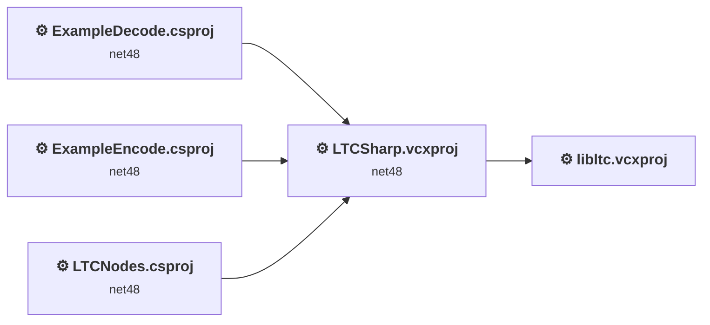
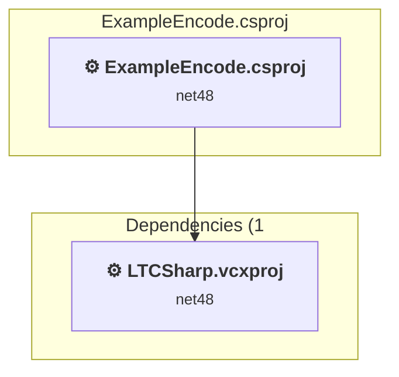
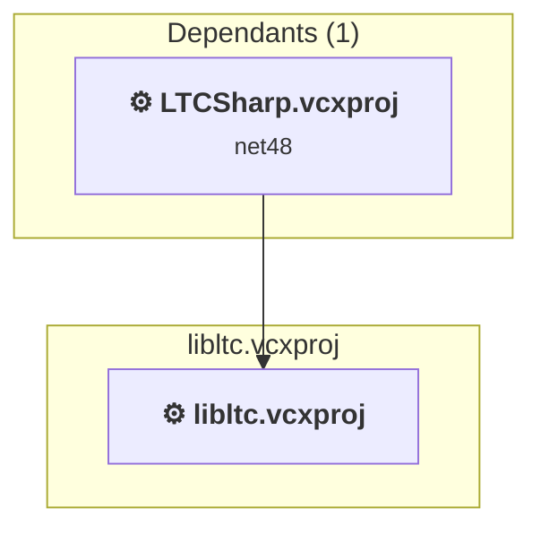
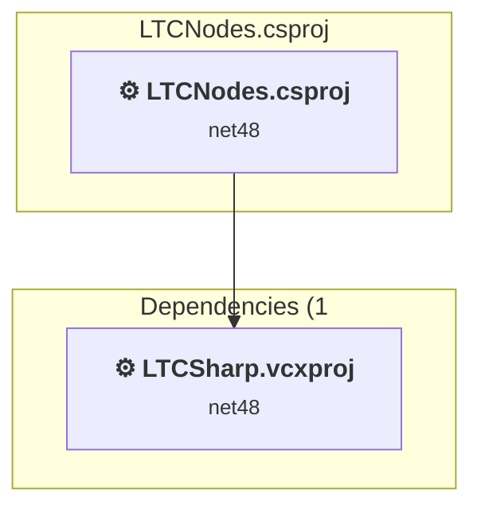
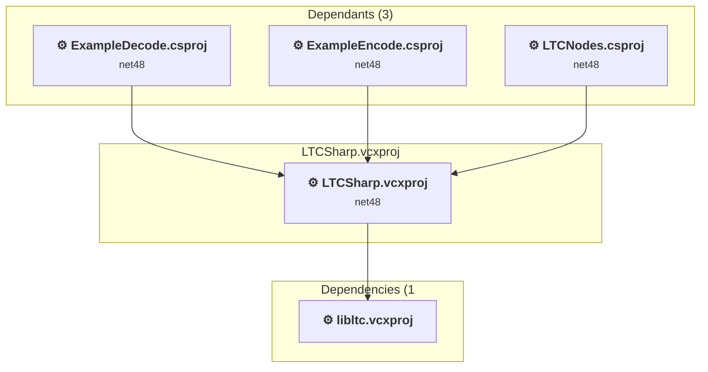

# Projects and dependencies analysis

This document provides a comprehensive overview of the projects and their dependencies in the context of upgrading to .NETCoreApp,Version=v10.0.

## Table of Contents

- [Executive Summary](#executive-Summary)
  - [Highlevel Metrics](#highlevel-metrics)
  - [Projects Compatibility](#projects-compatibility)
  - [Package Compatibility](#package-compatibility)
  - [API Compatibility](#api-compatibility)
  - [Binding Redirect Configuration](#binding-redirect-configuration)
- [Aggregate NuGet packages details](#aggregate-nuget-packages-details)
- [Top API Migration Challenges](#top-api-migration-challenges)
  - [Technologies and Features](#technologies-and-features)
  - [Most Frequent API Issues](#most-frequent-api-issues)
- [Projects Relationship Graph](#projects-relationship-graph)
- [Project Details](#project-details)

  - [ExampleDecode\ExampleDecode.csproj](#exampledecodeexampledecodecsproj)
  - [ExampleEncode\ExampleEncode.csproj](#exampleencodeexampleencodecsproj)
  - [libltc\libltc.vcxproj](#libltclibltcvcxproj)
  - [LTCNodes\LTCNodes.csproj](#ltcnodesltcnodescsproj)
  - [LTCSharp\LTCSharp.vcxproj](#ltcsharpltcsharpvcxproj)

## Executive Summary

### Highlevel Metrics

| Metric | Count | Status |
| :--- | :---: | :--- |
| Total Projects | 5 | 4 require upgrade |
| Total NuGet Packages | 20 | 7 need upgrade |
| Total Code Files | 8 |  |
| Total Code Files with Incidents | 5 |  |
| Total Lines of Code | 596 |  |
| Total Number of Issues | 50 |  |
| Estimated LOC to modify | 7+ | at least 1,2% of codebase |

### Projects Compatibility

| Project | Target Framework | Difficulty | Package Issues | API Issues | Binding Issues | Est. LOC Impact | Description |
| :--- | :---: | :---: | :---: | :---: | :---: | :---: | :--- |
| [ExampleDecode\ExampleDecode.csproj](#exampledecodeexampledecodecsproj) | net48 | 🟢 Low | 12 | 7 | 0 | 7+ | ClassicWinForms, Sdk Style = False |
| [ExampleEncode\ExampleEncode.csproj](#exampleencodeexampleencodecsproj) | net48 | 🟢 Low | 12 | 0 | 0 |  | ClassicDotNetApp, Sdk Style = False |
| [libltc\libltc.vcxproj](#libltclibltcvcxproj) |  | ✅ None | 0 | 0 | 0 |  | ClassicDotNetApp, Sdk Style = False |
| [LTCNodes\LTCNodes.csproj](#ltcnodesltcnodescsproj) | net48 | 🟢 Low | 12 | 0 | 0 |  | ClassicClassLibrary, Sdk Style = False |
| [LTCSharp\LTCSharp.vcxproj](#ltcsharpltcsharpvcxproj) | net48 | 🟢 Low | 0 | 0 | 0 |  | ClassicClassLibrary, Sdk Style = False |

### Package Compatibility

| Status | Count | Percentage |
| :--- | :---: | :---: |
| ✅ Compatible | 13 | 65,0% |
| ⚠️ Incompatible | 4 | 20,0% |
| 🔄 Upgrade Recommended | 3 | 15,0% |
| ***Total NuGet Packages*** | ***20*** | ***100%*** |

### API Compatibility

| Category | Count | Impact |
| :--- | :---: | :--- |
| 🔴 Binary Incompatible | 7 | High - Require code changes |
| 🟡 Source Incompatible | 0 | Medium - Needs re-compilation and potential conflicting API error fixing |
| 🔵 Behavioral change | 0 | Low - Behavioral changes that may require testing at runtime |
| ✅ Compatible | 465 |  |
| ***Total APIs Analyzed*** | ***472*** |  |

## Aggregate NuGet packages details

| Package | Current Version | Suggested Version | Projects | Description |
| :--- | :---: | :---: | :--- | :--- |
| Microsoft.Win32.Registry | 4.7.0 |  | [ExampleDecode.csproj](#exampledecodeexampledecodecsproj) [ExampleEncode.csproj](#exampleencodeexampleencodecsproj) [LTCNodes.csproj](#ltcnodesltcnodescsproj) | NuGet package functionality is included with framework reference |
| NAudio | 2.3.0 |  | [ExampleDecode.csproj](#exampledecodeexampledecodecsproj) [ExampleEncode.csproj](#exampleencodeexampleencodecsproj) [LTCNodes.csproj](#ltcnodesltcnodescsproj) | ✅Compatible |
| NAudio.Asio | 2.3.0 |  | [ExampleDecode.csproj](#exampledecodeexampledecodecsproj) [ExampleEncode.csproj](#exampleencodeexampleencodecsproj) [LTCNodes.csproj](#ltcnodesltcnodescsproj) | ✅Compatible |
| NAudio.Core | 2.3.0 |  | [ExampleDecode.csproj](#exampledecodeexampledecodecsproj) [ExampleEncode.csproj](#exampleencodeexampleencodecsproj) [LTCNodes.csproj](#ltcnodesltcnodescsproj) | ✅Compatible |
| NAudio.Midi | 2.3.0 |  | [ExampleDecode.csproj](#exampledecodeexampledecodecsproj) [ExampleEncode.csproj](#exampleencodeexampleencodecsproj) [LTCNodes.csproj](#ltcnodesltcnodescsproj) | ✅Compatible |
| NAudio.Wasapi | 2.3.0 |  | [ExampleDecode.csproj](#exampledecodeexampledecodecsproj) [ExampleEncode.csproj](#exampleencodeexampleencodecsproj) [LTCNodes.csproj](#ltcnodesltcnodescsproj) | ✅Compatible |
| NAudio.WinForms | 2.3.0 |  | [ExampleDecode.csproj](#exampledecodeexampledecodecsproj) [ExampleEncode.csproj](#exampleencodeexampleencodecsproj) [LTCNodes.csproj](#ltcnodesltcnodescsproj) | ✅Compatible |
| NAudio.WinMM | 2.3.0 |  | [ExampleDecode.csproj](#exampledecodeexampledecodecsproj) [ExampleEncode.csproj](#exampleencodeexampleencodecsproj) [LTCNodes.csproj](#ltcnodesltcnodescsproj) | ✅Compatible |
| System.Buffers | 4.5.1 |  | [ExampleDecode.csproj](#exampledecodeexampledecodecsproj) [ExampleEncode.csproj](#exampleencodeexampleencodecsproj) [LTCNodes.csproj](#ltcnodesltcnodescsproj) | NuGet package functionality is included with framework reference |
| System.Memory | 4.5.5 |  | [ExampleDecode.csproj](#exampledecodeexampledecodecsproj) [ExampleEncode.csproj](#exampleencodeexampleencodecsproj) [LTCNodes.csproj](#ltcnodesltcnodescsproj) | NuGet package functionality is included with framework reference |
| System.Numerics.Vectors | 4.5.0 |  | [ExampleDecode.csproj](#exampledecodeexampledecodecsproj) [ExampleEncode.csproj](#exampleencodeexampleencodecsproj) [LTCNodes.csproj](#ltcnodesltcnodescsproj) | NuGet package functionality is included with framework reference |
| System.Resources.Extensions | 8.0.0 | 10.0.9 | [ExampleDecode.csproj](#exampledecodeexampledecodecsproj) [ExampleEncode.csproj](#exampleencodeexampleencodecsproj) [LTCNodes.csproj](#ltcnodesltcnodescsproj) | NuGet package upgrade is recommended |
| System.Runtime.CompilerServices.Unsafe | 4.5.3 | 6.1.2 | [ExampleDecode.csproj](#exampledecodeexampledecodecsproj) [ExampleEncode.csproj](#exampleencodeexampleencodecsproj) [LTCNodes.csproj](#ltcnodesltcnodescsproj) | NuGet package upgrade is recommended |
| System.Security.AccessControl | 4.7.0 | 6.0.1 | [ExampleDecode.csproj](#exampledecodeexampledecodecsproj) [ExampleEncode.csproj](#exampleencodeexampleencodecsproj) [LTCNodes.csproj](#ltcnodesltcnodescsproj) | NuGet package upgrade is recommended |
| System.Security.Principal.Windows | 4.7.0 |  | [ExampleDecode.csproj](#exampledecodeexampledecodecsproj) [ExampleEncode.csproj](#exampleencodeexampleencodecsproj) [LTCNodes.csproj](#ltcnodesltcnodescsproj) | NuGet package functionality is included with framework reference |
| VVVV.Core | 39.0.0 |  | [ExampleDecode.csproj](#exampledecodeexampledecodecsproj) [ExampleEncode.csproj](#exampleencodeexampleencodecsproj) [LTCNodes.csproj](#ltcnodesltcnodescsproj) | ⚠️NuGet package is incompatible |
| VVVV.PluginInterfaces | 39.0.0 | 38.1.0 | [ExampleDecode.csproj](#exampledecodeexampledecodecsproj) [ExampleEncode.csproj](#exampleencodeexampleencodecsproj) [LTCNodes.csproj](#ltcnodesltcnodescsproj) | ⚠️NuGet package is incompatible |
| VVVV.SlimDX | 1.0.2 |  | [ExampleDecode.csproj](#exampledecodeexampledecodecsproj) [ExampleEncode.csproj](#exampleencodeexampleencodecsproj) [LTCNodes.csproj](#ltcnodesltcnodescsproj) | ✅Compatible |
| VVVV.System.ComponentModel.Composition.Codeplex | 2.5.0 |  | [ExampleDecode.csproj](#exampledecodeexampledecodecsproj) [ExampleEncode.csproj](#exampleencodeexampleencodecsproj) [LTCNodes.csproj](#ltcnodesltcnodescsproj) | ⚠️NuGet package is incompatible |
| VVVV.Utils | 39.0.0 |  | [ExampleDecode.csproj](#exampledecodeexampledecodecsproj) [ExampleEncode.csproj](#exampleencodeexampleencodecsproj) [LTCNodes.csproj](#ltcnodesltcnodescsproj) | ⚠️NuGet package is incompatible |

## Top API Migration Challenges

### Technologies and Features

| Technology | Issues | Percentage | Migration Path |
| :--- | :---: | :---: | :--- |
| Windows Forms | 7 | 100,0% | Windows Forms APIs for building Windows desktop applications with traditional Forms-based UI that are available in .NET on Windows. Enable Windows Desktop support: Option 1 (Recommended): Target net9.0-windows; Option 2: Add <UseWindowsDesktop>true</UseWindowsDesktop>; Option 3 (Legacy): Use Microsoft.NET.Sdk.WindowsDesktop SDK. |

### Most Frequent API Issues

| API | Count | Percentage | Category |
| :--- | :---: | :---: | :--- |
| P:System.Windows.Forms.FileDialog.FileName | 1 | 14,3% | Binary Incompatible |
| T:System.Windows.Forms.DialogResult | 1 | 14,3% | Binary Incompatible |
| M:System.Windows.Forms.CommonDialog.ShowDialog | 1 | 14,3% | Binary Incompatible |
| P:System.Windows.Forms.FileDialog.RestoreDirectory | 1 | 14,3% | Binary Incompatible |
| P:System.Windows.Forms.FileDialog.Filter | 1 | 14,3% | Binary Incompatible |
| T:System.Windows.Forms.OpenFileDialog | 1 | 14,3% | Binary Incompatible |
| M:System.Windows.Forms.OpenFileDialog.#ctor | 1 | 14,3% | Binary Incompatible |

## Projects Relationship Graph

Legend:
📦 SDK-style project
⚙️ Classic project

## Project Details

### ExampleDecode\ExampleDecode.csproj

#### Project Info

- **Current Target Framework:** net48
- **Proposed Target Framework:** net10.0-windows
- **SDK-style**: False
- **Project Kind:** ClassicWinForms
- **Dependencies**: 1
- **Dependants**: 0
- **Number of Files**: 2
- **Number of Files with Incidents**: 2
- **Lines of Code**: 150
- **Estimated LOC to modify**: 7+ (at least 4,7% of the project)

#### Dependency Graph

Legend:
📦 SDK-style project
⚙️ Classic project

### API Compatibility

| Category | Count | Impact |
| :--- | :---: | :--- |
| 🔴 Binary Incompatible | 7 | High - Require code changes |
| 🟡 Source Incompatible | 0 | Medium - Needs re-compilation and potential conflicting API error fixing |
| 🔵 Behavioral change | 0 | Low - Behavioral changes that may require testing at runtime |
| ✅ Compatible | 91 |  |
| ***Total APIs Analyzed*** | ***98*** |  |

#### Project Technologies and Features

| Technology | Issues | Percentage | Migration Path |
| :--- | :---: | :---: | :--- |
| Windows Forms | 7 | 100,0% | Windows Forms APIs for building Windows desktop applications with traditional Forms-based UI that are available in .NET on Windows. Enable Windows Desktop support: Option 1 (Recommended): Target net9.0-windows; Option 2: Add <UseWindowsDesktop>true</UseWindowsDesktop>; Option 3 (Legacy): Use Microsoft.NET.Sdk.WindowsDesktop SDK. |

### ExampleEncode\ExampleEncode.csproj

#### Project Info

- **Current Target Framework:** net48
- **Proposed Target Framework:** net10.0
- **SDK-style**: False
- **Project Kind:** ClassicDotNetApp
- **Dependencies**: 1
- **Dependants**: 0
- **Number of Files**: 2
- **Number of Files with Incidents**: 1
- **Lines of Code**: 120
- **Estimated LOC to modify**: 0+ (at least 0,0% of the project)

#### Dependency Graph

Legend:
📦 SDK-style project
⚙️ Classic project

### API Compatibility

| Category | Count | Impact |
| :--- | :---: | :--- |
| 🔴 Binary Incompatible | 0 | High - Require code changes |
| 🟡 Source Incompatible | 0 | Medium - Needs re-compilation and potential conflicting API error fixing |
| 🔵 Behavioral change | 0 | Low - Behavioral changes that may require testing at runtime |
| ✅ Compatible | 65 |  |
| ***Total APIs Analyzed*** | ***65*** |  |

### libltc\libltc.vcxproj

#### Project Info

- **Current Target Framework:** ✅
- **SDK-style**: False
- **Project Kind:** ClassicDotNetApp
- **Dependencies**: 0
- **Dependants**: 1
- **Number of Files**: 0
- **Lines of Code**: 0
- **Estimated LOC to modify**: 0+ (at least 0,0% of the project)

#### Dependency Graph

Legend:
📦 SDK-style project
⚙️ Classic project

### API Compatibility

| Category | Count | Impact |
| :--- | :---: | :--- |
| 🔴 Binary Incompatible | 0 | High - Require code changes |
| 🟡 Source Incompatible | 0 | Medium - Needs re-compilation and potential conflicting API error fixing |
| 🔵 Behavioral change | 0 | Low - Behavioral changes that may require testing at runtime |
| ✅ Compatible | 0 |  |
| ***Total APIs Analyzed*** | ***0*** |  |

### LTCNodes\LTCNodes.csproj

#### Project Info

- **Current Target Framework:** net48
- **Proposed Target Framework:** net10.0
- **SDK-style**: False
- **Project Kind:** ClassicClassLibrary
- **Dependencies**: 1
- **Dependants**: 0
- **Number of Files**: 4
- **Number of Files with Incidents**: 1
- **Lines of Code**: 326
- **Estimated LOC to modify**: 0+ (at least 0,0% of the project)

#### Dependency Graph

Legend:
📦 SDK-style project
⚙️ Classic project

### API Compatibility

| Category | Count | Impact |
| :--- | :---: | :--- |
| 🔴 Binary Incompatible | 0 | High - Require code changes |
| 🟡 Source Incompatible | 0 | Medium - Needs re-compilation and potential conflicting API error fixing |
| 🔵 Behavioral change | 0 | Low - Behavioral changes that may require testing at runtime |
| ✅ Compatible | 309 |  |
| ***Total APIs Analyzed*** | ***309*** |  |

### LTCSharp\LTCSharp.vcxproj

#### Project Info

- **Current Target Framework:** net48
- **Proposed Target Framework:** net10.0
- **SDK-style**: False
- **Project Kind:** ClassicClassLibrary
- **Dependencies**: 1
- **Dependants**: 3
- **Number of Files**: 0
- **Number of Files with Incidents**: 1
- **Lines of Code**: 0
- **Estimated LOC to modify**: 0+ (at least 0,0% of the project)

#### Dependency Graph

Legend:
📦 SDK-style project
⚙️ Classic project

### API Compatibility

| Category | Count | Impact |
| :--- | :---: | :--- |
| 🔴 Binary Incompatible | 0 | High - Require code changes |
| 🟡 Source Incompatible | 0 | Medium - Needs re-compilation and potential conflicting API error fixing |
| 🔵 Behavioral change | 0 | Low - Behavioral changes that may require testing at runtime |
| ✅ Compatible | 0 |  |
| ***Total APIs Analyzed*** | ***0*** |  |

